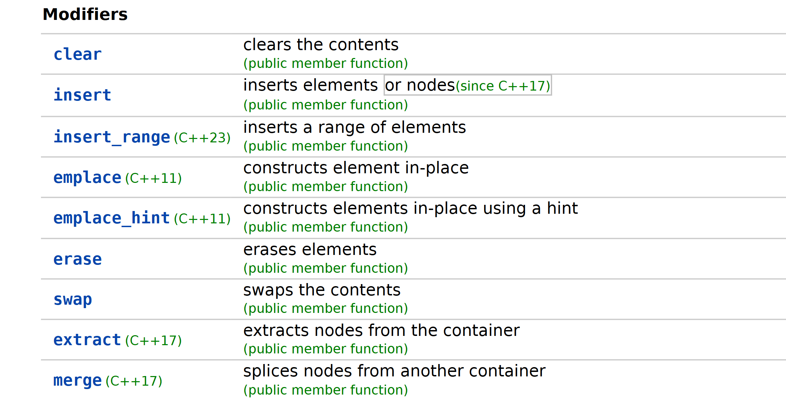
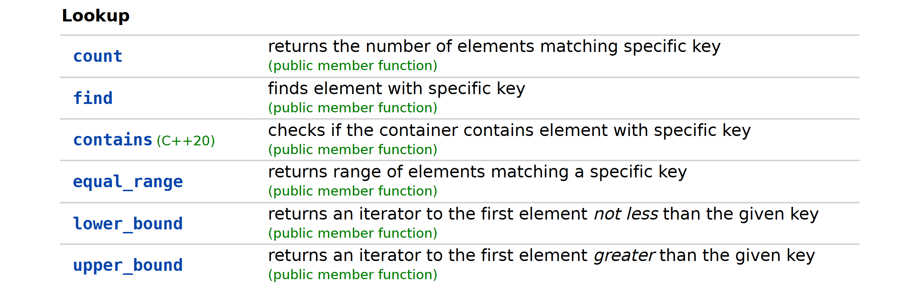

# cpp/set
### 文档
[set](https://cppreference.com/w/cpp/container/set.html)

### Modifiers

```cpp
std::set<int> set;

// 插入
auto result = set.insert(3);

const auto rg = {1, 2, 3};
ste.insert_range(rg);

// emplace

// swap
std::set<T> set1, set2;
// ... 填充 set1 和 set2 ...
set1.swap(set2); // 交换 set1 和 set2 的内容
// 等价于
std::swap(set1, set2); // 交换 set1 和 set2 的内容

```

### LookUp
