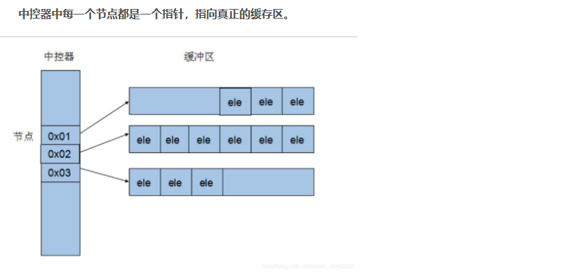

### introduction
c++基础知识笔记

### 标准库手册
[cpp reference](https://cppreference.com)

### Sequence containers
[[array]]
[[vector]]

### Associative containers
底层数据结构：[红黑树](https://www.cnblogs.com/crazymakercircle/p/16320430.html)
[[set]]
[[map]]

### Unordered associative containers
底层数据结构：哈希表
[[unordered_set]]
[[unordered_map]]

### Container adapters
对顺序容器的一层封装
[stack](https://cppreference.com/w/cpp/container/stack.html)
[queue](https://cppreference.com/w/cpp/container/queue.html)
[priority_queue](https://cppreference.com/w/cpp/container/priority_queue.html)
[deque](https://cppreference.com/w/cpp/container/deque.html)
[deque的实现原理](https://blog.csdn.net/qq_21989927/article/details/109403054)

[//begin]: # "Autogenerated link references for markdown compatibility"
[array]: array.md "cpp/array"
[vector]: vector.md "cpp/vector"
[set]: set.md "cpp/set"
[map]: map.md "cpp/map"
[unordered_set]: unordered_set.md "cpp/unordered_set"
[unordered_map]: unordered_map.md "cpp/unordered_map"
[//end]: # "Autogenerated link references"