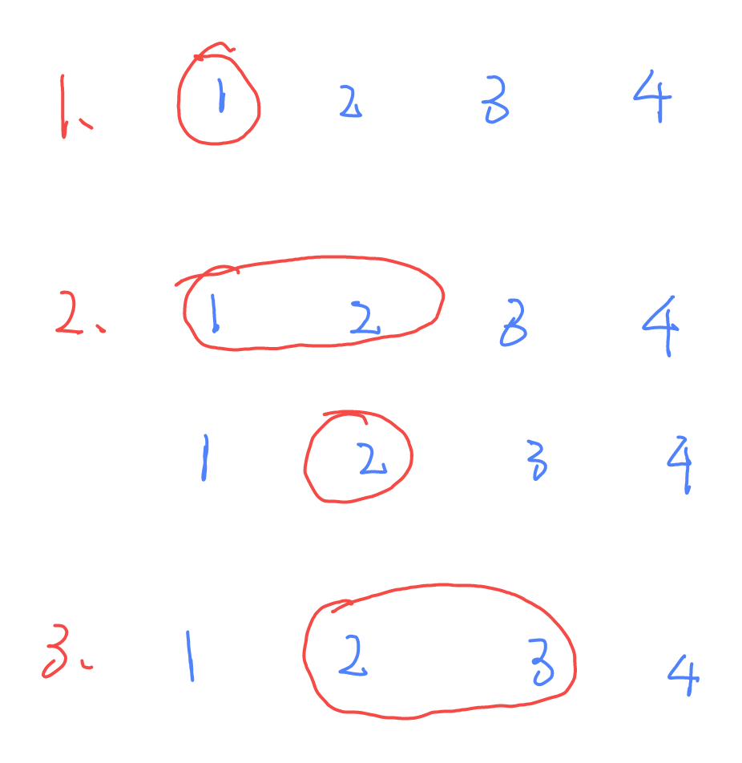
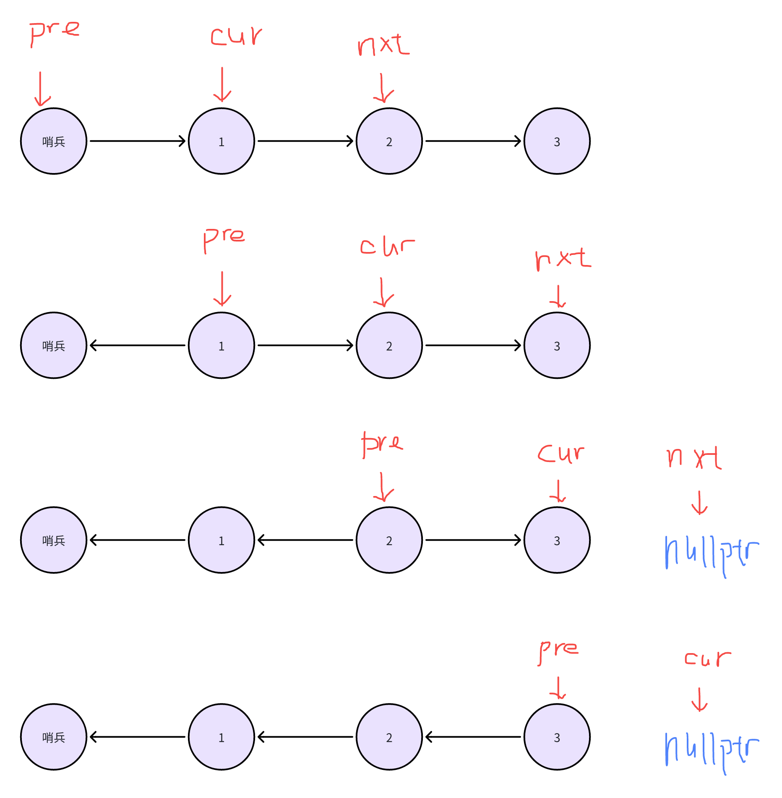

- [资源](#资源)
- [方法总结](#方法总结)
  - [滑动窗口](#滑动窗口)
    - [直观模拟](#直观模拟)
    - [使用条件](#使用条件)
    - [基本思路](#基本思路)
  - [二分查找](#二分查找)
    - [上取整公式](#上取整公式)
    - [并行累加](#并行累加)
    - [求最值](#求最值)
    - [翻译](#翻译)
    - [红蓝染色法](#红蓝染色法)
    - [感悟](#感悟)
  - [反转链表](#反转链表)
    - [核心](#核心)
    - [快慢指针](#快慢指针)
    - [算法](#算法)
    - [思想](#思想)


## 资源
[题单](https://github.com/EndlessCheng/codeforces-go/blob/master/leetcode/README.md)

[Cpp std库图解](hackingcpp.com)


## 方法总结
### 滑动窗口
#### 直观模拟

#### 使用条件
- 数组中一段连续区间

#### 基本思路
1. 枚举右端点
2. 不断移动左端点向右端点靠近，这一步核心是找到让左端点停下来的截止条件

---


### 二分查找
#### 上取整公式
#### 并行累加
```Cpp
std::vector<int> data{1, 2, 3, 4, 5};
auto sum = std::reduce(data.begin(), data.end(), 0);
```
$$ \space $$


#### 求最值
```Cpp
std::vector<int> data{1, 2, 3, 4, 5};
auto maxit = std::max_element(data.begin(), data.end());
```
$$ \space $$
#### 翻译
$$\geqslant \implies lower\_bound$$
$$> \implies \geqslant (x+1) \space \space upper\_bound$$
$$< \implies (\geqslant x)-1$$
$$\leqslant \implies (>x)-1$$

#### 红蓝染色法
定义红色是一类，蓝色是另一类

#### 感悟
二分核心不是有序，而是能找到将数组一分为二的依据

---


### 反转链表

#### 核心
结束时pre指向最后一个元素

#### 快慢指针
找出中心节点
#### 算法
slow指针走1格，fast指针走2格，当fast指针走到末节点或空指针时，slow指针指向的是中心节点

#### 思想
当快指针在末尾节点或空指针时，慢指针指向中心节点。这是因为快指针的速度总是慢指针的两倍

