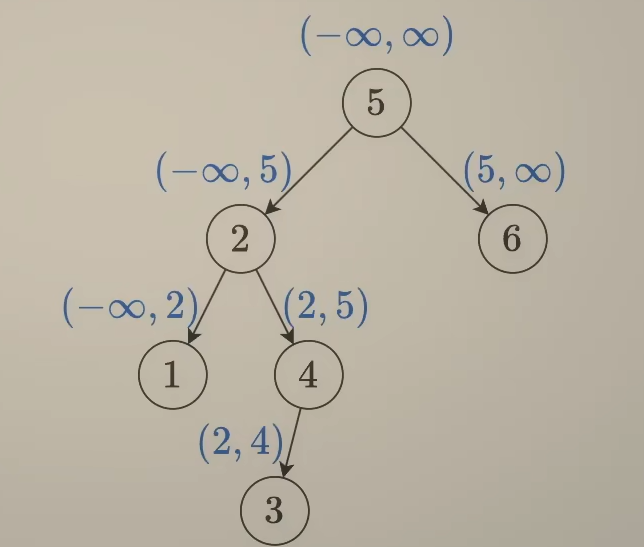

- [111. 二叉树的最小深度](#111-二叉树的最小深度)
  - [题解](#题解)
- [求根节点到叶节点数字之和](#求根节点到叶节点数字之和)
  - [题解](#题解-1)
- [好节点个数](#好节点个数)
  - [题解](#题解-2)
- [根叶路径上的不足节点](#根叶路径上的不足节点)
  - [分析](#分析)
  - [题解](#题解-3)
- [验证二叉树](#验证二叉树)
  - [我的题解](#我的题解)
  - [思路1](#思路1)
  - [题解1-前序遍历](#题解1-前序遍历)
  - [思路2-中序遍历](#思路2-中序遍历)
  - [题解2](#题解2)
  - [思路3-后续遍历](#思路3-后续遍历)
  - [题解3](#题解3)
- [二叉搜索树范围和](#二叉搜索树范围和)
  - [思路1](#思路1-1)
  - [题解1](#题解1)
  - [思路2](#思路2)
  - [题解2](#题解2-1)
- [根据遍历序列构造二叉树](#根据遍历序列构造二叉树)
  - [前、中序列](#前中序列)
  - [后、中序列](#后中序列)
  - [前、后序列](#前后序列)
- [深化理解](#深化理解)
  - [基本代码模板](#基本代码模板)


### 111. 二叉树的最小深度
给定一个二叉树，找出其最小深度。

最小深度是从根节点到最近叶子节点的最短路径上的节点数量。

说明：叶子节点是指没有子节点的节点。


[topic](https://leetcode.cn/problems/minimum-depth-of-binary-tree/description/)

#### 题解
自底向上归
```cpp
int minDepth(TreeNode* root) {
    if (!root)
        return 0;

    if (!root->left) {
        return minDepth(root->right) + 1;
    } else if(!root->right)
    {
        return minDepth(root->left) + 1;
    } 
    else {
        return min(minDepth(root->left), minDepth(root->right)) + 1;
    }
}
```
自上向下递
```cpp

int minDepth(TreeNode* root) {
    int ans = INT_MAX;
    auto dfs = [&](this auto&& dfs, TreeNode* node, int cnt) -> void {
        if (node == nullptr) {
            return;
        }
        cnt++;
        if (node->left == nullptr && node->right == nullptr) { // node 是叶子
            ans = min(ans, cnt);
            return;
        }
        dfs(node->left, cnt);
        dfs(node->right, cnt);
    };
    dfs(root, 0);
    return root ? ans : 0;
}

// 作者：灵茶山艾府
// 链接：https://leetcode.cn/problems/minimum-depth-of-binary-tree/solutions/2730984/liang-chong-fang-fa-zi-ding-xiang-xia-zi-0sxz/
// 来源：力扣（LeetCode）
// 著作权归作者所有。商业转载请联系作者获得授权，非商业转载请注明出处。
```

如果发现cnt>=ans,由于继续递归不会减小cnt，因此可以直接返回，即最优性剪枝
```Cpp

int minDepth(TreeNode* root) {
    int ans = INT_MAX;
    auto dfs = [&](this auto&& dfs, TreeNode* node, int cnt) -> void {
        if (node == nullptr || ++cnt >= ans) { // 最优性剪枝
            return;
        }
        if (node->left == nullptr && node->right == nullptr) { // node 是叶子
            ans = cnt;
            return;
        }
        dfs(node->left, cnt);
        dfs(node->right, cnt);
    };
    dfs(root, 0);
    return root ? ans : 0;
}

// 作者：灵茶山艾府
// 链接：https://leetcode.cn/problems/minimum-depth-of-binary-tree/solutions/2730984/liang-chong-fang-fa-zi-ding-xiang-xia-zi-0sxz/
// 来源：力扣（LeetCode）
// 著作权归作者所有。商业转载请联系作者获得授权，非商业转载请注明出处。
```


---

### 求根节点到叶节点数字之和
给你一个二叉树的根节点 root ，树中每个节点都存放有一个 0 到 9 之间的数字。
每条从根节点到叶节点的路径都代表一个数字：

- 例如，从根节点到叶节点的路径 1 -> 2 -> 3 表示数字 123 。
计算从根节点到叶节点生成的 所有数字之和 。

叶节点 是指没有子节点的节点。

[topic](https://leetcode.cn/problems/sum-root-to-leaf-numbers/description/)

#### 题解
4 -> 9 -> 5
$$
x = 0 \\
x = 10 * x + 4 \\
x = 10 * x + 9 \\
x = 10 * x + 5 \\
x = 495
$$
```cpp
x = x * 10 + node->val;
```


```cpp
int sumNumbers(TreeNode* root) {
    int ans = 0;
    auto dfs = [&](this auto&& dfs, TreeNode *node, int x) -> void {
        if(!node) return;
        x = x * 10 + node->val;
        if(!node->left && !node->right)
        {
            ans += x;
            return;
        }
        dfs(node->left, x);
        dfs(node->right, x);
    };
    dfs(root, 0);
    return ans;
}
```

---

### 好节点个数
[topic](https://leetcode.cn/problems/count-good-nodes-in-binary-tree/description/)
#### 题解
```cpp
int goodNodes(TreeNode* root) {
    int cnt = 0;
    auto dfs = [&](this auto&& dfs, TreeNode *node, int max) -> void {
        if(!node) return;
        if(node->val >= max)
        {
            // 好节点
            max = node->val;
            cnt++;
        }
        dfs(node->left, max);
        dfs(node->right, max);
    };
    dfs(root, root->val);
    return cnt;
}
```
```cpp
int goodNodes(TreeNode* root, int mx = INT_MIN) {
    if(!root) return 0;
    int nmx = max(mx, root->val);
    int left = goodNodes(root->left, nmx);
    int right = goodNodes(root->right, nmx);
    return left + right + (root->val >= mx);
}
```


---

### 根叶路径上的不足节点
[topic](https://leetcode.cn/problems/insufficient-nodes-in-root-to-leaf-paths/description/)
- 根叶路径和：根到叶所有节点值的和
- 不足节点：经过该节点任何根叶路径和都小于limit

#### 分析
- 对于一个节点
  - 如果它是叶子节点，那么对比路径和与limit，若小于limit，应该删除
  - 如果它是非叶子节点，
    - 如果它的孩子都被删除，那么说明经过这个node的所有根叶路径和都小于limit，那么应该删除
    - 如果它还有孩子，那么至少还有一条路径是满足的，那么不用删除它

#### 题解
```cpp
TreeNode* sufficientSubset(TreeNode* root, int limit, int sumPath = 0) {
    sumPath += root->val;
    if (!root->left && !root->right)
        return (sumPath >= limit) ? root : nullptr;
    if (root->left)
        root->left =
            sufficientSubset(root->left, limit, sumPath);
    if (root->right)
        root->right =
            sufficientSubset(root->right, limit, sumPath);
    return root->left || root->right ? root : nullptr;
}
```
    


---

### 验证二叉树
#### 我的题解
```cpp
bool isValidBST(TreeNode* root) {
    if(root == nullptr) return true;
    bool condi = true;
    if(root->left)
    {
        condi = isValidBST(root->left) && (root->left->val < root->val);
    }
    if(root->right)
    {
        condi = condi && isValidBST(root->right) && (root->right->val > root->val);
    }
    return condi;
}
```


#### 思路1

前序遍历，验证每一个节点都在区间中

#### 题解1-前序遍历
```Cpp
bool isValidBST(TreeNode* root, int low = INT_MIN, int high = INT_MAX) {
    if(root == nullptr) return true;
    int x = root->val;
    return (x > low) && (x < high) && isValidBST(root->left, low, x) && isValidBST(root->right , x, high);
}
```

#### 思路2-中序遍历
中序遍历-中序遍历出的序列应该是严格递增的

#### 题解2
```Cpp
bool isValidBST(TreeNode* root) {
    long pre = LONG_MIN;
    auto isValid = [&](this auto&& isValid, TreeNode *node) -> bool {
        if(node == nullptr) return true;
        if(!isValid(node->left)) return false;
        if(node->val <= pre) return false;
        pre = node->val;
        if(!isValid(node->right)) return false;
        return true;
    };
    return isValid(root); 
}
```

#### 思路3-后续遍历
后续遍历
首先会得到左右子树的范围$[l_{min}, l_{max}] [r_{min}, r_{max}]$，节点x应该满足 $l_{max}<x<r_{min}$ 

#### 题解3
```Cpp
bool isValidBST(TreeNode* root) {
    auto dfs = [](this auto&& dfs, TreeNode *node) -> std::pair<long, long> {
        if(node == nullptr) return {LONG_MAX, LONG_MIN};
        auto [l_min, l_max] = dfs(node->left);
        auto [r_min, r_max] = dfs(node->right);
        long x = node->val;
        if(x <= l_max || x>=r_min) return {LONG_MIN, LONG_MAX};
        return {min(l_min, x), max(r_max, x)};
    };
    return dfs(root).second != LONG_MAX;
}
```


---

### 二叉搜索树范围和
[topic](https://leetcode.cn/problems/range-sum-of-bst/description/)
#### 思路1
类比二分查找的做法，
$$
[low, high] = [low, +inf) - [high, +inf)
$$


#### 题解1
```cpp
class Solution {
private:
    // 计算树中所有节点之和
    int sumTree(TreeNode *node) {
        int ans = 0;
        auto dfs = [&](this auto&& dfs, TreeNode *node) -> void {
            if(node == nullptr) return;
            ans += node->val;
            dfs(node->left);
            dfs(node->right);
        };
        dfs(node);
        return ans;
    }

    // 计算[bound, 无穷) 的值
    int lowerbound(TreeNode *node, int bound) {
        if(node == nullptr) return 0;
        if(bound > node->val){
            return lowerbound(node->right, bound);
         } else if(bound == node->val) {
            return node->val + sumTree(node->right);
         } else {
            return node->val + sumTree(node->right) + lowerbound(node->left, bound);
         }
    }
public:
    int rangeSumBST(TreeNode* root, int low, int high) {
        return lowerbound(root, low) - lowerbound(root, high + 1);
    }
};
```
#### 思路2
一个节点
- 节点值小于low，那么应该在它的右子树上求范围和
- 节点大于high，那么应该在它的左子树上求范围和
- 否则（节点值介于low到high），那么范围和是 node->val + rangeBSTSum(node->right) + rangeBSTSum(node->left);

#### 题解2
```cpp
class Solution {
public:
    int rangeSumBST(TreeNode* root, int low, int high) {
        if(root == nullptr) return 0;
        if(root->val < low) {
            return rangeSumBST(root->right, low, high);
        } else if (root->val > high) {
            return rangeSumBST(root->left, low, high);
        }
        return root->val + rangeSumBST(root->left, low, high) + rangeSumBST(root->right, low, high);
    }
};
```


---


### 根据遍历序列构造二叉树
#### 前、中序列 
- 前序遍历：根-左-右
- 中序遍历：左-根-右

```cpp
TreeNode* buildTree(vector<int>& preorder, vector<int>& inorder) {
    if(preorder.empty()) return nullptr;
    int left_size = ranges::find(inorder, preorder[0]) - inorder.begin();
    vector<int> pre1(preorder.begin() + 1, preorder.begin() + 1 + left_size);
    vector<int> pre2 (preorder.begin() + 1 + left_size, preorder.end());
    vector<int> in1(inorder.begin(), inorder.begin() + left_size);
    vector<int> in2(inorder.begin() + 1 + left_size, inorder.end());
    TreeNode* left = buildTree(pre1, in1);
    TreeNode* right = buildTree(pre2, in2);
    return new TreeNode(preorder[0], left, right);
}
```


#### 后、中序列 
- 后序遍历：左-右-根
- 中序遍历：左-根-右
```cpp
TreeNode* buildTree(vector<int>& inorder, vector<int>& postorder) 
{
    if (postorder.empty()) { // 空节点
        return nullptr;
    }
    int left_size = ranges::find(inorder, postorder.back()) - inorder.begin(); // 左子树的大小
    vector<int> in1(inorder.begin(), inorder.begin() + left_size);
    vector<int> in2(inorder.begin() + left_size + 1, inorder.end());
    vector<int> post1(postorder.begin(), postorder.begin() + left_size);
    vector<int> post2(postorder.begin() + left_size, postorder.end() - 1);
    TreeNode* left = buildTree(in1, post1);
    TreeNode* right = buildTree(in2, post2);
    return new TreeNode(postorder.back(), left, right);
}

```

#### 前、后序列 
- 前序遍历：根-左-右
- 厚序遍历：左-右-根
```cpp
TreeNode* constructFromPrePost(vector<int>& preorder, vector<int>& postorder) {
    if (preorder.empty()) { // 空节点
        return nullptr;
    }
    if (preorder.size() == 1) { // 叶子节点
        return new TreeNode(preorder[0]);
    }
    int left_size = ranges::find(postorder, preorder[1]) - postorder.begin() + 1; // 左子树的大小
    vector<int> pre1(preorder.begin() + 1, preorder.begin() + 1 + left_size);
    vector<int> pre2(preorder.begin() + 1 + left_size, preorder.end());
    vector<int> post1(postorder.begin(), postorder.begin() + left_size);
    vector<int> post2(postorder.begin() + left_size, postorder.end() - 1);
    TreeNode* left = constructFromPrePost(pre1, post1);
    TreeNode* right = constructFromPrePost(pre2, post2);
    return new TreeNode(preorder[0], left, right);
}
```

---


### 深化理解
#### 基本代码模板
topic：求最大递归深度
```Cpp
// 自底向上归
int maxDepth(ListNode *root) {
    if(!root) return 0;
    lh = maxDepth(root->left);
    rh = maxDepth(root->right);

    return max(lh, rh) + 1;
}
```
```cpp
// 自顶向下递
int maxDepth(ListNode *root) {
    int ans = 0;
    auto dfs = [&](this auto&& dfs, TreeNode* root, int cnt) -> void
    {
        if(!root) return;
        ans = max(++cnt, ans);
        dfs(root->left, cnt);
        dfs(root->right, cnt);
    }; // 注意这里分号不可省
    dfs(root, 0);
    return ans;

}
```
