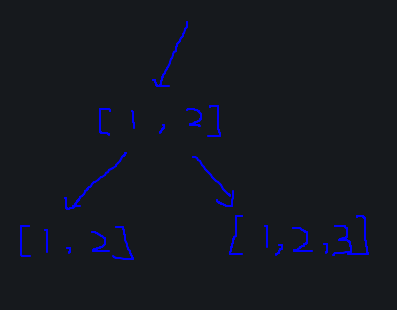

# notes/回溯子集型

### 子集问题
#### 代码
从输入角度
```Cpp
vector<vector<int>> subsets(vector<int>& nums) {
    int n = nums.size();
    if(n == 0) return {};
    // 初始条件
    vector<vector<int>> ans;
    auto dfs = [&](this auto&& dfs, int i) -> void {
        // 截止条件
        if(i == n) {
            ans.emplace_back(ele);
            return;
        }
        // 状态转移
        dfs(i + 1);
        ele.push_back(nums[i]);
        dfs(i + 1);
        ele.pop_back(); // 恢复现场
    };
    dfs(0);
    return ans;
}

```

从列举角度
```Cpp
vector<vector<int>> subsets(vector<int>& nums) {
    int n = nums.size();
    vector<vector<int>> ans;
    vector<int> path;

    auto dfs = [&](this auto&& dfs, int i) -> void {
        ans.emplace_back(path);
        for(int j = i; j < n; j++) {
            path.push_back(nums[j]);
            dfs(j + 1);
            path.pop_back(); // 恢复现场
        }
    };
    dfs(0);
    return ans;
}
```

#### 为什么要恢复现场

上图中，当递到[1, 2, 3]后，归到[1, 2]时，应该进行恢复现场，也就对应代码：
```Cpp
// 状态转移
dfs(i + 1);
ele.push_back(nums[i]);
dfs(i + 1);
ele.pop_back(); // 恢复现场
```


### 回文子串
#### 代码
```Cpp
vector<vector<string>> partition(string s) {
    vector<vector<ans>>
}
```


### 深化理解
#### 思考模板
- 如何从状态d[i] --> d[i+1]
- 边界条件是什么
  - 初始条件
  - 截止条件

#### 代码模板
```Cpp
class Solution {
private:
    static constexpr string MAPPING[10] = {"", "", "abc", "def", "ghi", "jkl", "mno", "pqrs", "tuv", "wxyz"};
public:
    vector<string> letterCombinations(string digits) {
        int n = digits.length();
        if(n == 0) return {}; // 边界条件

        vector<string> ans;
        string path(n, 0);
        
        auto dfs = [&](this auto&& dfs, int i) -> void {
            if(i == n) {
                ans.emplace_back(path);
                return;
            }
            for(char c: MAPPING[digits[i] -'0']) { // 递推操作
                path[i] = c;
                dfs(i + 1);
            }
        };
        dfs(0);
        return ans;
    }
};
```
