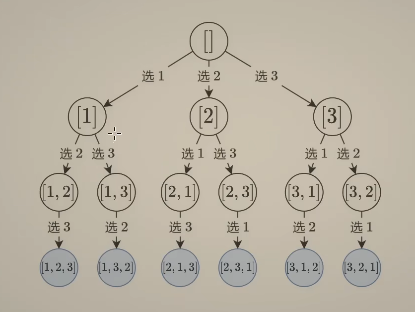

# 回溯排列型

### 思路-下一个选什么

### 代码模板
```Cpp
 vector<vector<int>> permute(vector<int> &nums) {
    int n = nums.size();
    vector<vector<int>> ans;
    vector<int> path(n), on_path(n); // 所有排列的长度都是一样的 n
    auto dfs = [&](this auto&& dfs, int i) {
        if (i == n) {
            ans.emplace_back(path);
            return;
        }
        for (int j = 0; j < n; j++) {
            if (!on_path[j]) {
                path[i] = nums[j]; // 从没有选的数字中选一个
                on_path[j] = true; // 已选上
                dfs(i + 1);
                on_path[j] = false; // 恢复现场
                // 注意 path 无需恢复现场，因为排列长度固定，直接覆盖就行
            }
        }
    };
    dfs(0);
    return ans;
}
```


