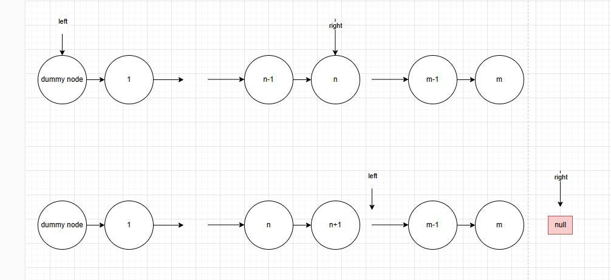
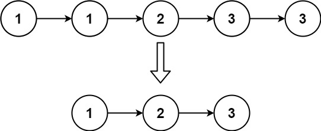
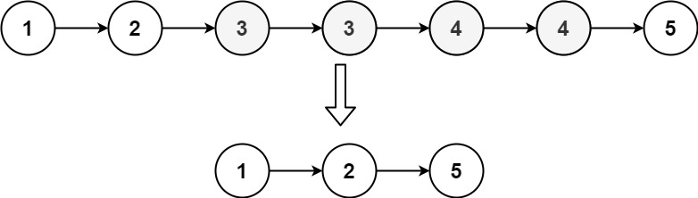
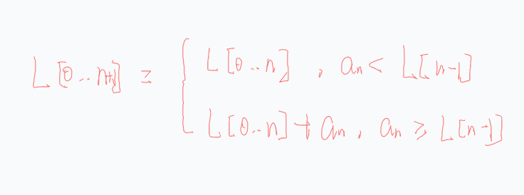
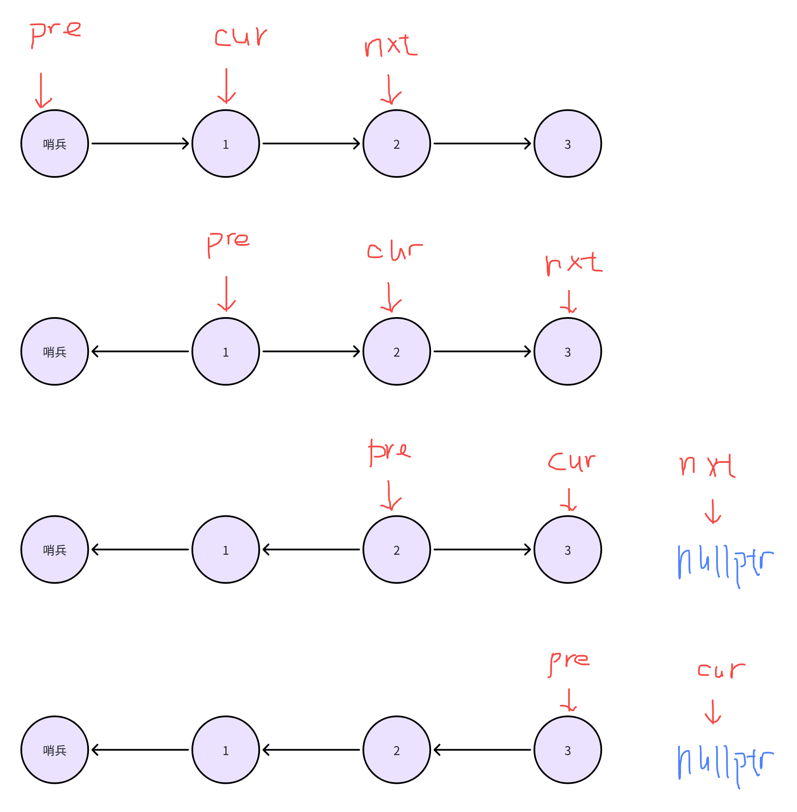
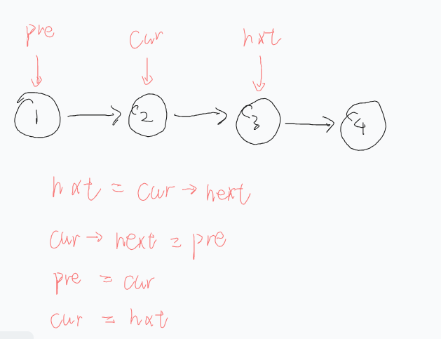
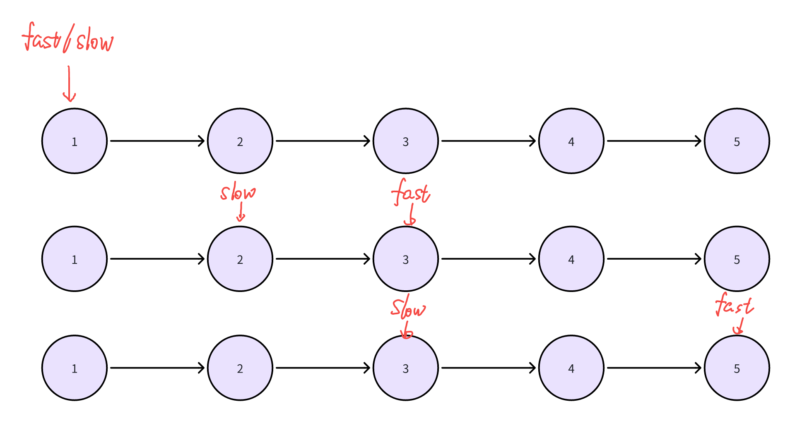

- [删除倒数第N个节点](#删除倒数第n个节点)
- [删除排序链表中的重复元素](#删除排序链表中的重复元素)
  - [复盘](#复盘)
- [删除排序链表中的重复元素 II](#删除排序链表中的重复元素-ii)
  - [复盘](#复盘-1)
- [2487. 从链表中移除节点](#2487-从链表中移除节点)
- [深化基础知识理解](#深化基础知识理解)
  - [反转链表](#反转链表)
    - [核心](#核心)
  - [快慢指针](#快慢指针)
    - [算法](#算法)
    - [思想](#思想)
  - [删除节点](#删除节点)
  - [什么时候用dummy node](#什么时候用dummy-node)


### 删除倒数第N个节点

```cpp
class Solution {
public:
    ListNode* removeNthFromEnd(ListNode* head, int n) {
        ListNode sent=ListNode(0, head);
        ListNode *dummy=&sent;
        ListNode *left=dummy;
        ListNode *right=dummy;
        for(int i=0; i<n; i++)
        {
            right=right->next;
        }
        while(right->next)
        {
            left=left->next;
            right=right->next;
        }
        // 删除left的下一个节点
        ListNode *nxt=left->next;
        left->next=left->next->next;
        delete nxt;
        
        return dummy->next;

    }
};

```


---


### 删除排序链表中的重复元素


[topic](https://leetcode.cn/problems/remove-duplicates-from-sorted-list/) 
```cpp
class Solution
{
public:
    ListNode *deleteDuplicates(ListNode *head)
    {
        // 哨兵
        ListNode sb = ListNode(-101, head);
        ListNode *cur = head;
        ListNode *pre = &sb;
        while (cur != nullptr)
        {
            if (cur->val == pre->val)
            {
                pre->next = cur->next;
                cur = cur->next;
            }
            else
            {
                pre = cur;
                cur = cur->next;
            }
        }
        return sb.next;
    }
};
```

#### 复盘
这题不需要用哨兵，因为头节点一定会保留
```cpp
class Solution {
public:
    ListNode* deleteDuplicates(ListNode* head) {
        if (head == nullptr) {
            return nullptr;
        }
        ListNode* cur = head;
        while (cur->next) { // 看看下个节点……
            if (cur->next->val == cur->val) { // 和我一样，删！
                cur->next = cur->next->next;
            } else { // 和我不一样，移动到下个节点
                cur = cur->next;
            }
        }
        return head;
    }
};


// 作者：灵茶山艾府
// 链接：https://leetcode.cn/problems/remove-duplicates-from-sorted-list/solutions/2004062/ru-he-qu-zhong-yi-ge-shi-pin-jiang-tou-p-98g7/
```


---


### 删除排序链表中的重复元素 II

[topic](https://leetcode.cn/problems/remove-duplicates-from-sorted-list-ii/)
```cpp
class Solution
{
public:
    ListNode *deleteDuplicates(ListNode *head)
    {
        if (head == nullptr)
            return nullptr;
        ListNode sb = ListNode(-101, head);            
        ListNode res = ListNode(-101, 0);
        ListNode *slow = &res;
        ListNode *fast = head;
        ListNode *pre = &sb;

        // 每次遇到相同值把first置为false，first为true就可以 slow=pre
        bool first = false;
        while (fast != nullptr)
        {
            while (fast != nullptr && fast->val == pre->val)
            {
                first = false;
                fast = fast->next;
            }
            if (fast == nullptr)
                break;
            // fast停在第一个与前值不同的节点，如1 1 2 的2
            if (first)
            {
                slow->next = pre;
                slow->next->next = nullptr;
                slow = pre;
            }
            else
                first = true;

            pre = fast;
            fast = fast->next;
        }
        if (first)
        {
            slow->next = pre;
            slow->next->next = nullptr;
        }

        return res.next;
    }
};

```
#### 复盘
- 需要dummy node，因为头节点可能被删除
- 要删除值，就必须持有前一个节点，所以我们对比的是cur->nxt和再后面节点的关系

```cpp
class Solution {
public:
    ListNode* deleteDuplicates(ListNode* head) {
        ListNode dummy(0, head);
        auto cur = &dummy;
        while (cur->next && cur->next->next) {
            int val = cur->next->val;
            if (cur->next->next->val == val) { // 后两个节点值相同
                // 值等于 val 的节点全部删除
                while (cur->next && cur->next->val == val) {
                    cur->next = cur->next->next;
                }
            } else {
                cur = cur->next;
            }
        }
        return dummy.next;
    }
};

// 作者：灵茶山艾府
// 链接：https://leetcode.cn/problems/remove-duplicates-from-sorted-list-ii/solutions/2004067/ru-he-qu-zhong-yi-ge-shi-pin-jiang-tou-p-2ddn/
```


---

### 2487. 从链表中移除节点
[topic](https://leetcode.cn/problems/remove-nodes-from-linked-list/description/)


输入：head = [5,2,13,3,8]
输出：[13,8]
解释：需要移除的节点是 5 ，2 和 3 。
- 节点 13 在节点 5 右侧。
- 节点 13 在节点 2 右侧。
- 节点 8 在节点 3 右侧。

这道题翻译一下就是：从后往前找一个单调（非严格）递增的序列
那么可以写出递推关系


```cpp
// 反转链表+迭代删除

class Solution {
public:
    ListNode* removeNodes(ListNode* head) {
        // 反转链表
        head = rotate(head);

        int max =  0;
        ListNode dummy(0, head);
        ListNode *cur = &dummy;
        while(cur->next)
        {
            if(cur->next->val >= max)
            {
                max = cur->next->val;
                cur = cur->next;
            } else
            {
                // 删除节点
                cur->next = cur->next->next;
            }
        }
        return rotate(dummy.next);
    }

    ListNode* rotate(ListNode* head) {
        ListNode* pre = nullptr;
        ListNode* cur = head;
        ListNode* nxt = nullptr;

        while (cur) {
            nxt = cur->next;
            cur->next = pre;
            pre = cur;
            cur = nxt;
        }

        return pre;
    }
};
```
递归本质就是在倒着遍历链表
```cpp
// 递归

class Solution {
public:
    ListNode *removeNodes(ListNode *head) {
        if (head->next == nullptr) {
            return head;
        }
        ListNode *node = removeNodes(head->next); // 返回的链表头一定是最大的
        if (node->val > head->val) {
            return node; // 删除 head
        }
        head->next = node; // 不删除 head
        return head;
    }
};

// 作者：灵茶山艾府
// 链接：https://leetcode.cn/problems/remove-nodes-from-linked-list/solutions/1993491/di-gui-jian-ji-xie-fa-by-endlesscheng-jfwi/
// 来源：力扣（LeetCode）
// 著作权归作者所有。商业转载请联系作者获得授权，非商业转载请注明出处。
```


---


### 深化基础知识理解
#### 反转链表

##### 核心
结束时pre指向最后一个元素



```cpp
// core snippets
nxt = cur->next;
cur->next = pre;
pre = cur;
cur = nxt;
```
```cpp
ListNode* rotate(ListNode* head) {
    ListNode* pre = nullptr;
    ListNode* cur = head;
    ListNode* nxt = nullptr;

    while (cur) {
        nxt = cur->next;
        cur->next = pre;
        pre = cur;
        cur = nxt;
    }

    return pre;
}
```

#### 快慢指针
找出中心节点
##### 算法
slow指针走1格，fast指针走2格，当fast指针走到末节点或空指针时，slow指针指向的是中心节点

##### 思想
当快指针在末尾节点或空指针时，慢指针指向中心节点。这是因为快指针的速度总是慢指针的两倍

#### 删除节点 
$$
删除节点 = 将前驱节点指向后继节点
$$ 
```cpp
cur-next = cur->next->next;
```

#### 什么时候用dummy node 
当头节点有可能被删除时，就要使用dummy node 


